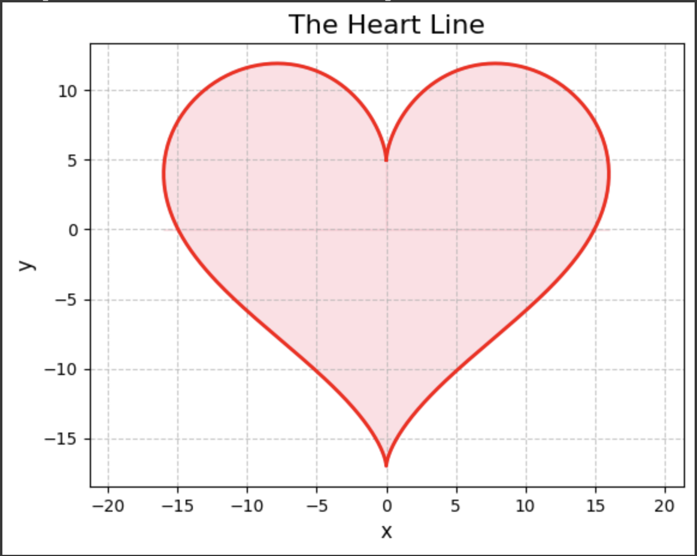

# Generation_AI

- 姓名：張訓豪
- 系級：資工 115
- 課程名稱：生成式AI：文字與圖像生成的原理與實務_國立臺灣師範大學衛星課程
- 修課學期：113-2

---

## HW1

1. colab 連結：[NTNU_41147006S_資工115_張訓豪_HW1.ipynb](https://colab.research.google.com/drive/1vYjFXjYaOafzweyWzKbFmQfy4ytYD4Hu?usp=sharing)
2. 使用 Gemini 生成一個愛心函數圖形
3. 成果如圖

