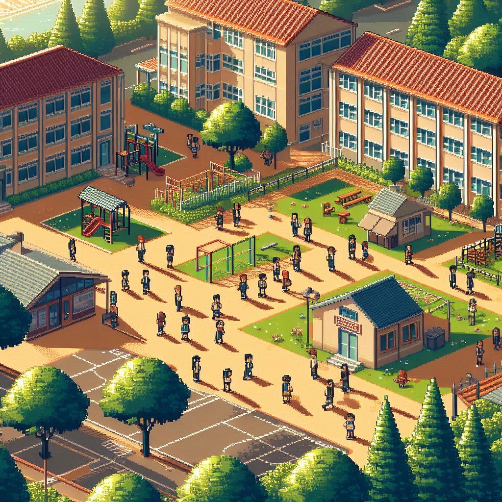
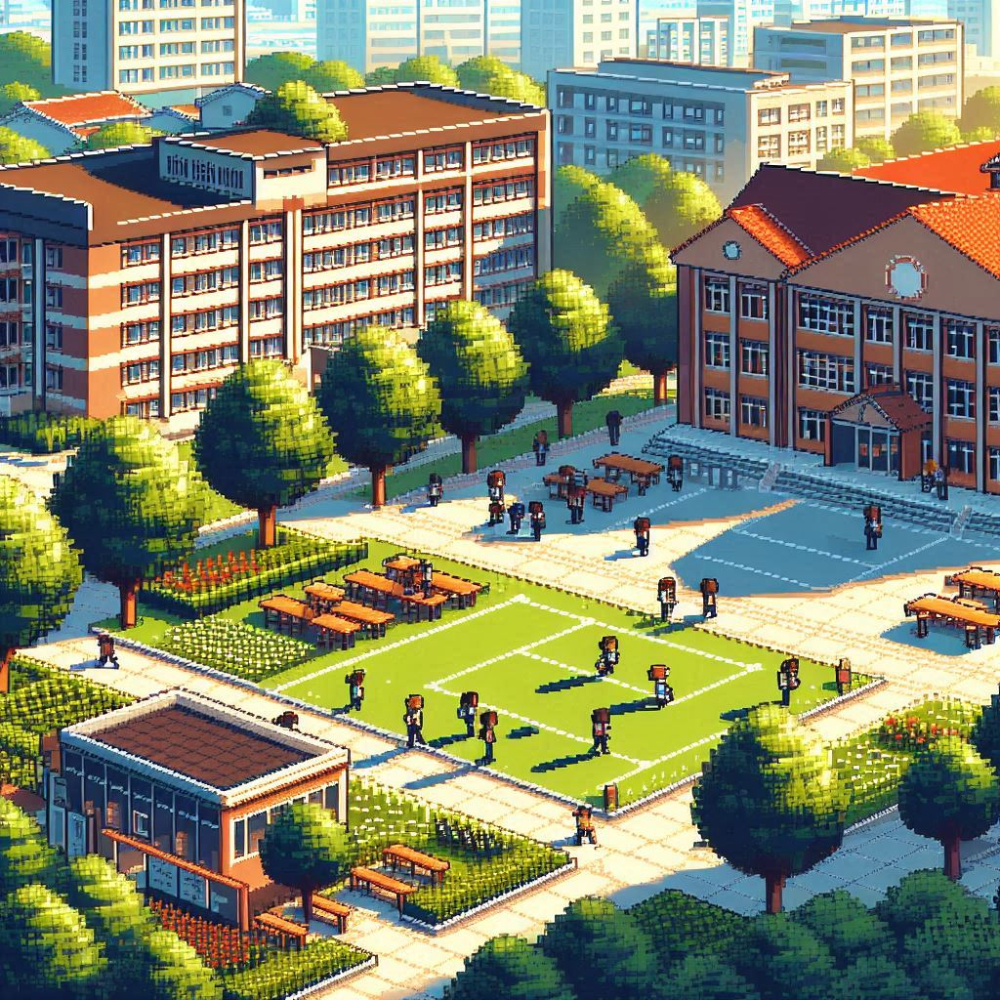
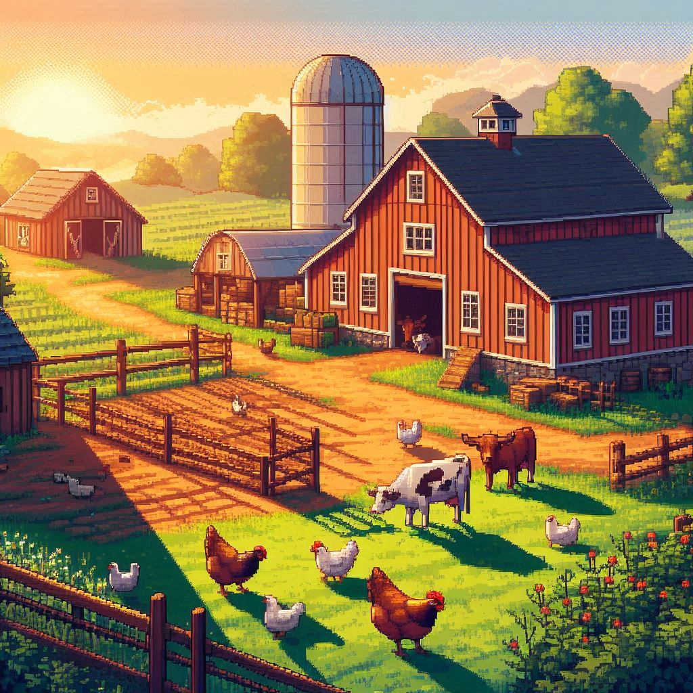
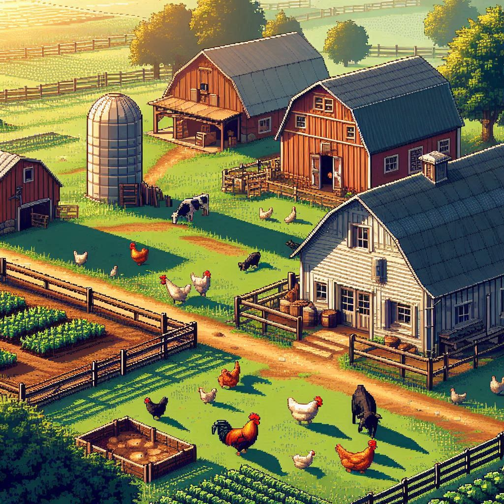
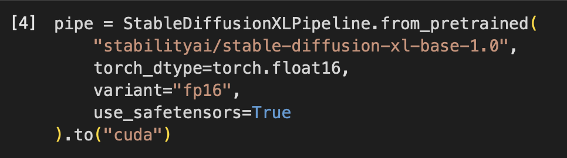
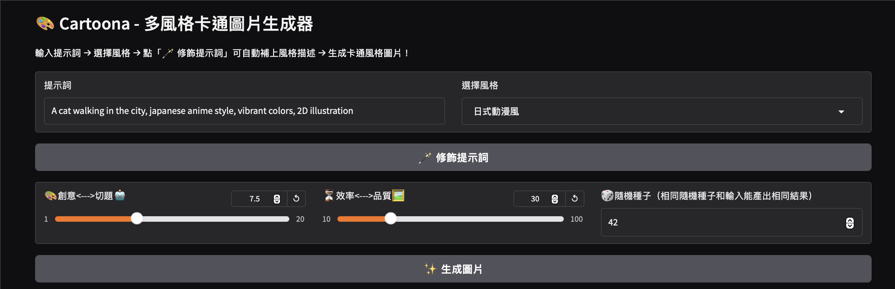
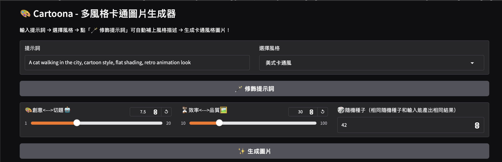
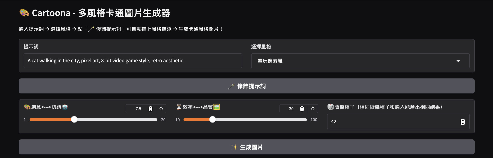
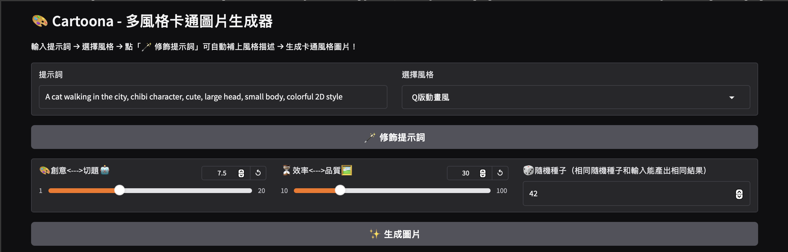
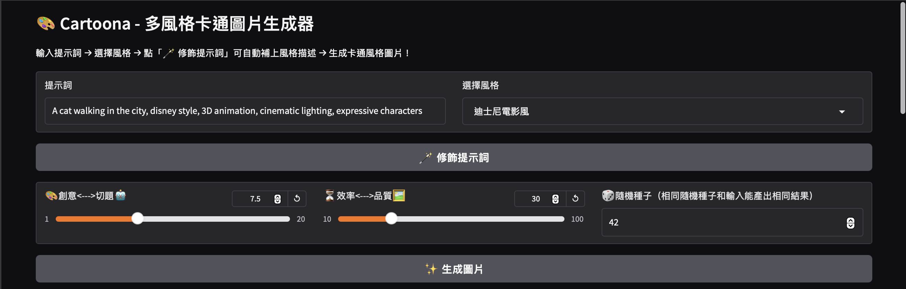

# Generation_AI

- 姓名：張訓豪
- 系級：資工 115
- 課程名稱：生成式AI：文字與圖像生成的原理與實務_國立臺灣師範大學衛星課程
- 修課學期：113-2

---

## HW1

1. Colab 連結：[NTNU_41147006S_資工115_張訓豪_HW1.ipynb](https://colab.research.google.com/drive/1vYjFXjYaOafzweyWzKbFmQfy4ytYD4Hu?usp=sharing)
2. 使用 Gemini 生成一個愛心函數圖形
3. 成果如圖

---

## HW2

1. Colab 連結：[NTNU_41147006S_資工115_張訓豪_HW2.ipynb](https://colab.research.google.com/drive/1ZRq9PwEPcd7xEvnU-Kiog8aaawrO7b0c?usp=sharing)
2. 打造自己的DNN(全連結)手寫辨識
3. 參數和正確率如圖

4. Gradio 測試如圖

---

## HW3

完成主題一書面報告   
詳情請見檔案

---

## HW4

完成書面報告  
詳情請見檔案

---

## HW5

1. Colab 連結：[NTNU_41147006S_資工115_張訓豪_HW5.ipynb](https://colab.research.google.com/drive/14hw7wnQ9tEs9si_dIh_F1EtdAF0bpiji?usp=sharing)
2. 用OpenAI API打造自己的對話機器人  
3. 測試結果如圖  
  
  

---

## HW6

1. Colab 連結：[NTNU_41147006S_資工115_張訓豪_HW6.ipynb](https://colab.research.google.com/drive/1YSl_A1uoNj4N4BJYbRyqEGMpxSUiO-3L?usp=sharing)  
2. 製作主題一：更改上週作業成可以持續對話的版本  
3. 機器人背景設定  
  
4. 機器人使用模型  
  
5. 測試結果  

---

## HW7

1. Colab 連結：[NTNU_41147006S_資工115_張訓豪_HW7.ipynb](https://colab.research.google.com/drive/1Vch591ZmTa7b3PYaexJynDkxUhAE74AY?usp=sharing)  
2. 實作RAG系統
3. 使用資料為一些中文經典歌曲的資訊，包括以下幾點  
  - 歌名  
  - 歌手  
  - 發行時間  
  - 歌曲時長  
  - 歌詞節錄  
  - 歌曲簡介  
4. 機器人背景設定  
  
5. 測試結果  

---

## HW8

1. Colab 連結：[NTNU_41147006S_資工115_張訓豪_HW8.ipynb](https://colab.research.google.com/drive/11CW4XpvhaMVYF8qQ3jLKY1LVaim3HmIM?usp=sharing)
2. 實作 Reflection AI Agent  
3. 機器人 writer 和 reviewer 設定如下  
  
4. 測試結果  
  

---

## HW9

1. 主題：中英文 prompt 對 AI 製圖的影響
2. 使用像素風
3. prompt 和生成圖片
  - "A realistic modern city street scene at sunset in pixel art style, with cars, streetlights, people walking, and detailed buildings, vibrant colors and retro video game vibe."  
      
  - 「一幅以像素藝術風格呈現的寫實現代都市街景，背景為夕陽時分，有汽車、街燈、行人和細緻的建築物，色彩鮮豔，帶有懷舊電玩遊戲的氛圍。」  
      
  - "A realistic pixel art style school campus during the afternoon, with students walking around, classrooms, a playground, trees, and shadows cast by the sun, detailed textures and nostalgic video game aesthetic."  
      
  - 「一幅以像素藝術風格呈現的寫實學校校園場景，時間為下午，有學生在校園中走動、教室、操場、樹木，以及陽光灑下的陰影，細緻的紋理與懷舊電玩遊戲的美感。」  
      
  - "A realistic pixel art style night scene of a convenience store on a street corner, with glowing neon lights, reflections on the wet pavement, a few people walking with umbrellas, warm light coming from inside the store, and a moody, nostalgic atmosphere."
      
  - 「一幅以像素藝術風格呈現的寫實夜景，場景為街角的便利商店，有閃爍的霓虹燈、濕潤地面的倒影、撐傘的行人、從店內透出的溫暖燈光，以及充滿情感與懷舊氛圍的夜晚街景。」
      
  - "A realistic pixel art style countryside farm at sunrise, with a barn, grassy fields, chickens pecking on the ground, cows in a pen, a dog near the farmhouse, and warm morning light casting long shadows. Peaceful and nostalgic rural atmosphere."
      
  - 「一幅以像素藝術風格呈現的寫實鄉村農場晨景，有穀倉、綠色田野、在地上啄食的雞、欄中的牛、一隻在農舍附近的狗，以及灑下長長陰影的溫暖晨光。整體氛圍寧靜而懷舊，充滿鄉村氣息。」
      

---

## HW10

1. Colab 連結：[NTNU_41147006S_資工115_張訓豪_HW10.ipynb](https://colab.research.google.com/drive/18J-9EOqMeU13y1j7JtyZ3JgNM9UrkwhH?usp=sharing)
2. 多風格卡通圖片生成器
3. 使用模型
  
4. prompt 和生成圖片
    
  
  
  
  
  
  
  
  
  

---

## HW11

完成書面報告  
詳情請見檔案

---
